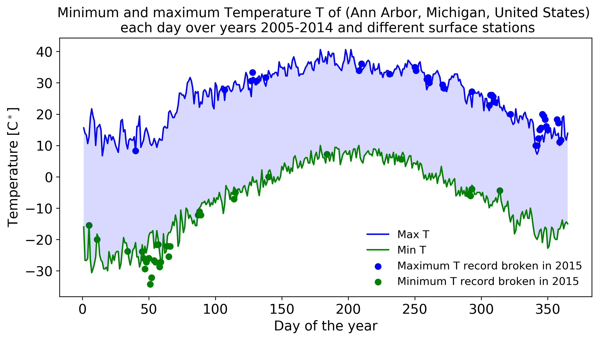

# Weather pattern
In this project, I use weather data of Michigan city to study the weather pattern.

## Note
I use bitbucket for the version control as It provides free private repositories. If you want to get full development-history for this code, please email me on mail02ankit@gmail.com.

If you use this code, send me a pizza at mail02ankit@gmail.com

